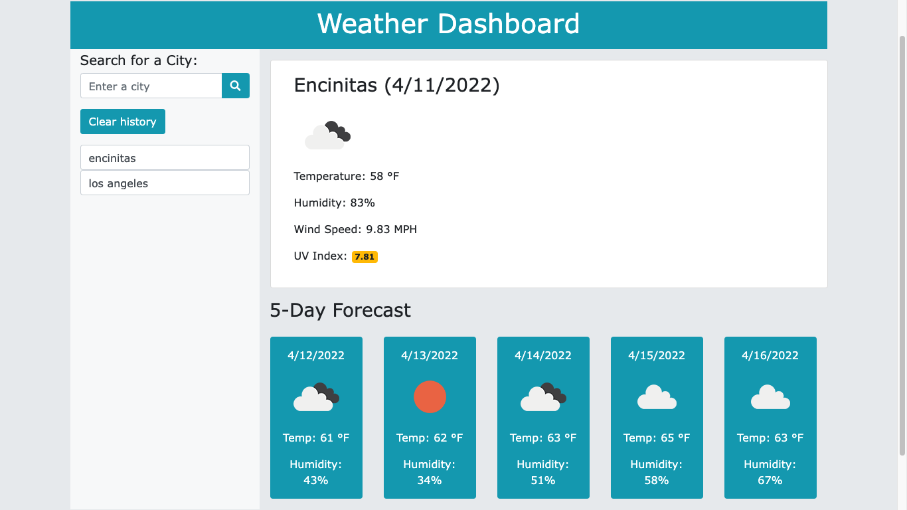

# Weather Dashboard

## Table of Contents

- [Description](#description)
- [Installation](#installation)
- [User Story](#user_story)
- [Screenshot](#screenshot)
- [Languages](#languages)
- [License](#license)
- [Contact](#contact)

## Description

A simple web application that allows users to search for a city to get the current weather and 5 day forecast. Previously viewed cities are saved to local storage.

## Installation

Runs in browser.

## User Story

- AS A traveler
- I WANT to see the weather outlook for multiple cities
- SO THAT I can plan a trip accordingly

## Screenshot

## Languages

CSS, HTML, Bootstrap, OpenWeather API

## License

MIT

## Testing

none

## Contact:

ShawnArgent (https://github.com/ShawnArgent)  
 kshawn001@gmail.com
